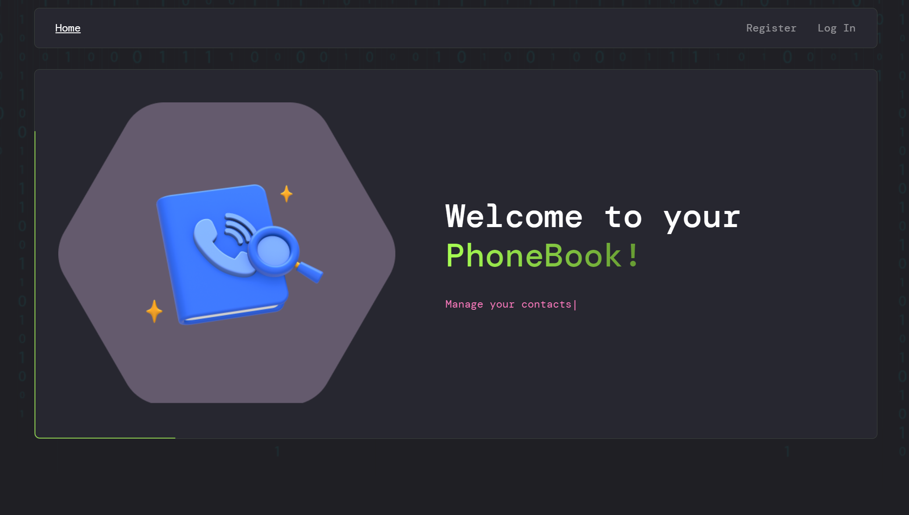
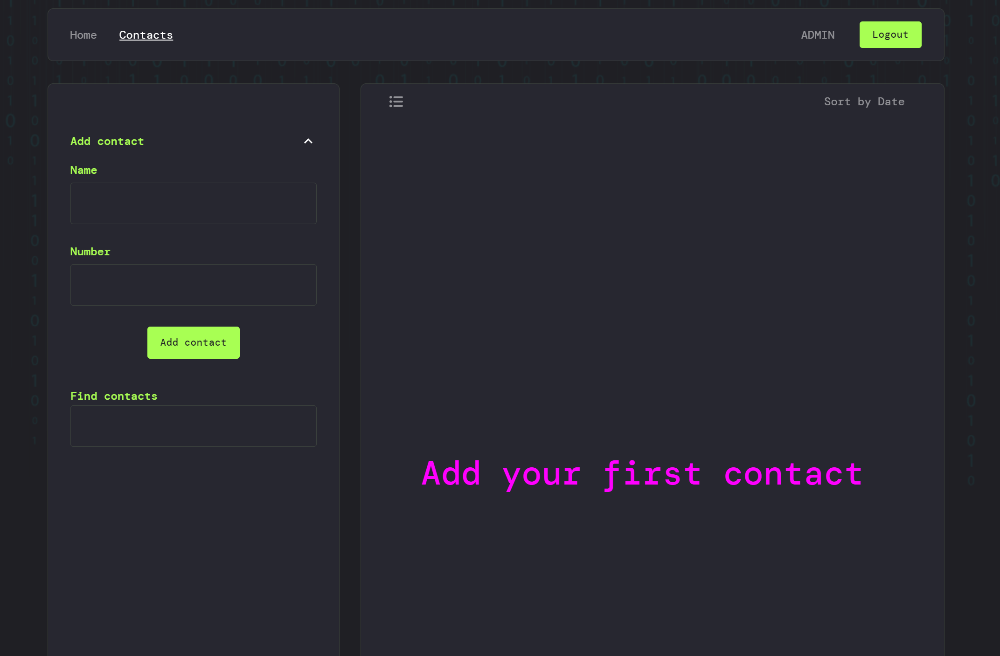

# PhoneBook



## 📖 Description

**PhoneBook** is the final project of the **React** module. It allows users to save and manage their contacts after registration. The project features a fully responsive design, ensuring usability on both mobile devices and desktops.

## 🚀 Features

- User registration and authentication.
- Add, delete, and edit contacts.
- Sort contacts by name or date.
- Search contacts by name or number.
- Fully responsive interface.

## 📸 Screenshots

### Contact List



## 🛠 Technologies

- **React** - A framework for building user interfaces.
- **Redux** - State management.
- **Axios** - HTTP client for API requests.
- **Formik** and **Yup** - Form management and validation.
- **Framer Motion** - Animation library.
- **Vite** - Fast build tool.
- **MUI (Material UI)** - Component library.
- **react-router-dom** - Routing and navigation.
- **redux-persist** - Persistence of state in local storage.
- And many other libraries, such as `react-hot-toast`, `react-spinners`, `email-validator`, etc.

## 📦 Installation

Clone the repository, install dependencies, and run the project:

```bash
npm install
npm run dev
```

Open http://localhost:5173 in your browser. For production build:

```
npm run build
```
